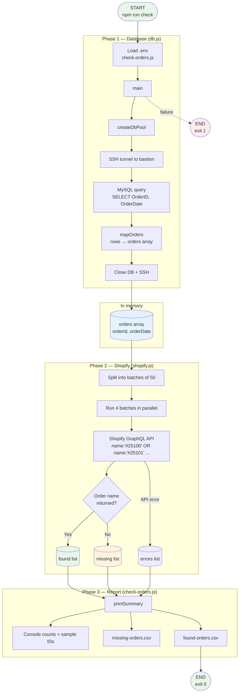
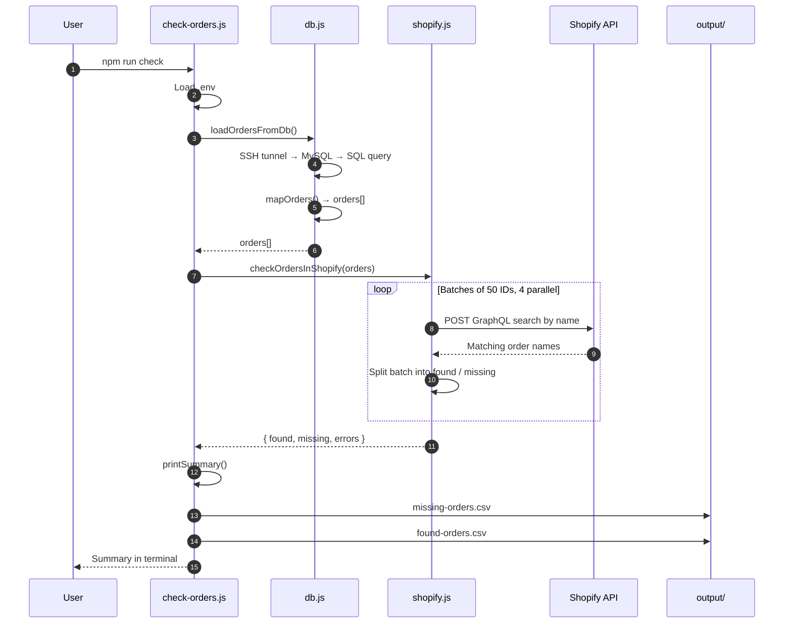
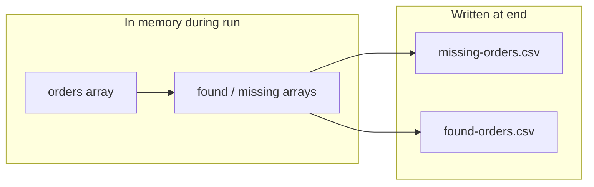

# Fonts DB → Shopify Order Check

Compares order IDs from the MyFonts database against Shopify and writes CSV reports of **found** and **missing** orders.

## Quick start

```bash
cp .env.example .env   # fill in credentials
npm install
npm run check
```

Output files are written to `output/`:

- `missing-orders-<timestamp>.csv`
- `found-orders-<timestamp>.csv`

---

## Workflow diagram



### Sequence view



---

## Project structure

| File | Role |
|------|------|
| `src/check-orders.js` | Entry point. Orchestrates DB load → Shopify check → CSV output |
| `src/db.js` | SSH tunnel, MySQL connection, SQL query, row mapping |
| `src/shopify.js` | Shopify GraphQL batch lookups and comparison |
| `src/test-db.js` | Optional: test DB connection only (`npm run test:db`) |
| `scripts/export-orders.sql` | Reference SQL (same query the app uses) |
| `.env` | Credentials and settings |

---

## Code-level workflow (simple terms)

### 1. START — `check-orders.js` → `main()`

When you run `npm run check`, Node executes `src/check-orders.js`, loads `.env`, and calls `main()`.

---

### 2. Load orders from database — `loadOrdersFromDb()`

**File:** `src/check-orders.js` → calls **`src/db.js`**

| Step | Function | What it does |
|------|----------|--------------|
| 2a | `createDbPool()` | SSH to bastion, open tunnel to MySQL, connect with SSL |
| 2b | `fetchOrdersFromDb()` | Run SQL: `SELECT OrderID, OrderDate FROM mf_user.Orders WHERE OrderDate between ? and ?` |
| 2c | `mapOrders()` | Convert rows to `[{ orderId, orderDate }, ...]` |
| 2d | `close()` | Close MySQL pool and SSH tunnel |

Data is stored in the `orders` array **in memory (RAM)**.

---

### 3. Check Shopify — `checkOrdersInShopify(orders)`

**File:** `src/shopify.js`

1. Split DB orders into **batches of 50** (`SHOPIFY_BATCH_SIZE`).
2. Run **4 batches in parallel** (`SHOPIFY_CONCURRENCY`).
3. Each API call searches Shopify with:
   ```
   name:'#25100' OR name:'#25101' OR ... OR name:'#25149'
   ```
4. For each ID in the batch: if Shopify returned a matching name → **found**, else → **missing**.
5. Returns `{ found, missing, errors }` in memory.

For 175k orders: ~3,500 API calls (175k ÷ 50), run 4 at a time.

---

### 4. Write report — `printSummary()`

**File:** `src/check-orders.js`

1. Logs counts to the console (sample of missing IDs).
2. Writes `output/missing-orders-<timestamp>.csv` and `output/found-orders-<timestamp>.csv`.

---

### 5. END

Success → exit 0. Error → exit 1.

---

## How DB OrderID maps to Shopify

| Source | Value |
|--------|-------|
| Database | `OrderID = 25170` |
| Shopify order name | `#25170` |
| API search | `name:'#25170'` |

```env
SHOPIFY_ORDER_NAME_PREFIX='#'
```

---

## Configuration (.env)

| Variable | Purpose |
|----------|---------|
| `SSH_*` | SSH tunnel to reach MySQL |
| `DB_*` | MySQL credentials |
| `DB_SSL` | Required `true` for this server |
| `ORDER_DATE_FROM` / `ORDER_DATE_TO` | Date range to query from DB |
| `ORDER_LIMIT` | `0` = all orders in range |
| `SHOPIFY_SHOP` | Shopify shop hostname |
| `SHOPIFY_ACCESS_TOKEN` | Admin API token |
| `SHOPIFY_ORDER_NAME_PREFIX` | Usually `'#'` |
| `SHOPIFY_BATCH_SIZE` | Order IDs per API call (default 50) |
| `SHOPIFY_CONCURRENCY` | Parallel API calls (default 4) |

---

## Commands

| Command | Description |
|---------|-------------|
| `npm run check` | Full run: DB → Shopify → CSV |
| `npm run test:db` | Test MySQL connection only |

---

## Memory vs disk



CSV files are the only persistent output.
